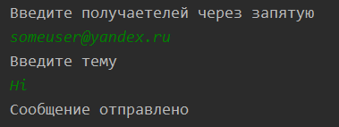
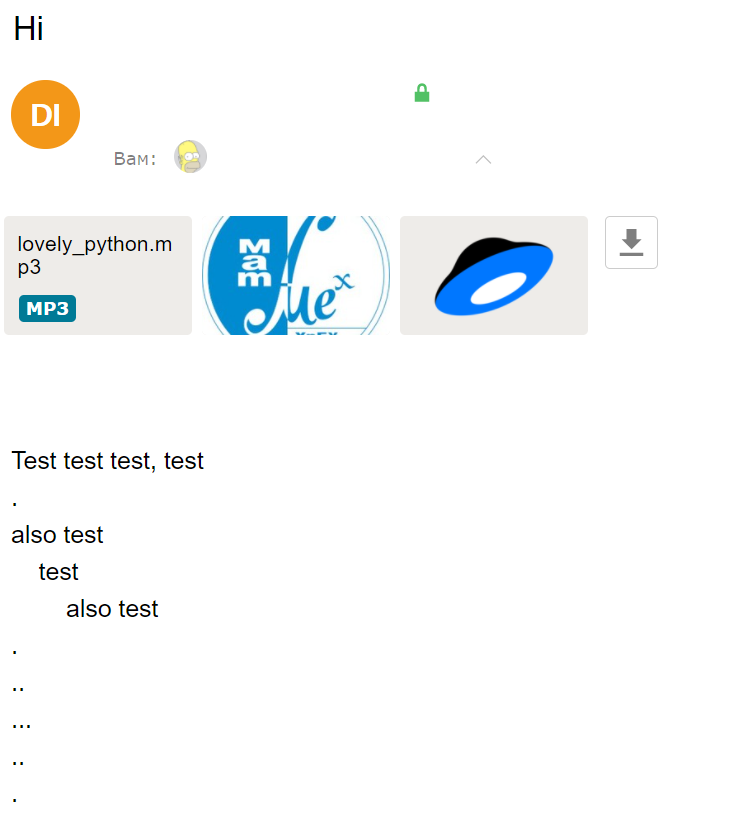

# SMTP Клиент
Данное решение является реализацией примитивного smtp клиента с возможностью прикрепления файлов к письму.

## Требования
* Python версии не ниже, чем 3.6

## Ипользование
В настройках у `user` указать `login` и `password`

## Пример запуска
```
python smtp_client.py
```
### Отправка сообщения


### На ящике получателя
